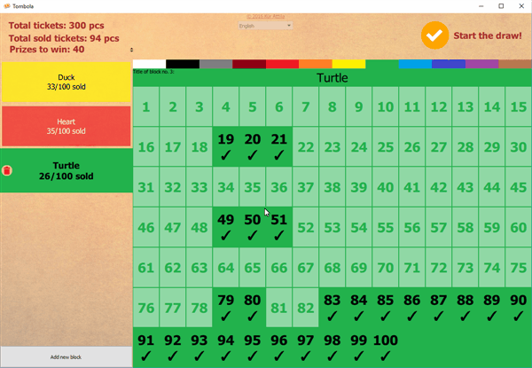
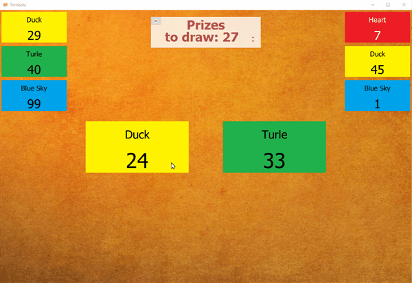

# Tombola
Prize drawing tool with Visualization

- Create customizable ticket blocks (combination of different colors + title)
- Easily mark which tickets have been sold

- 2 parallel drawings at once, animated side-by-side

